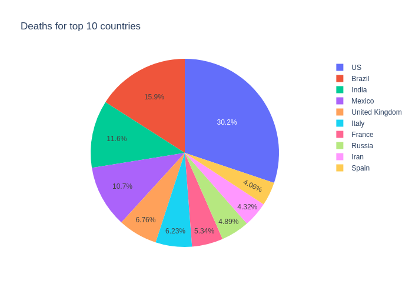

## Time series analysis with covid data

The first objective of this repository is to collect daily COVID-19 Data from the Center for Systems Science and Engineering (CSSE) at Johns Hopkins University.

Then there are some instances of data exploration and plotting.

Pie-chart of top 10 countries with confirmed cases

Pie chart of top 10 countries with Deaths

Finally Time series analysis is done ARIMA model to fit and forecast the future.

